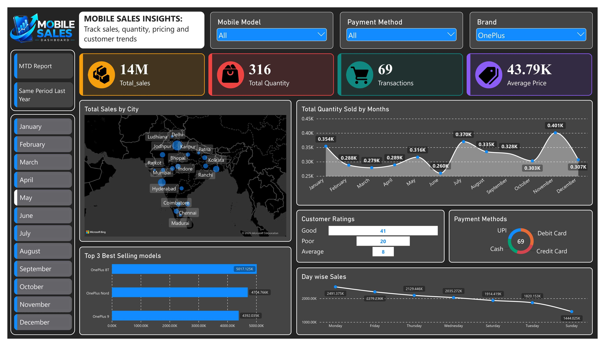
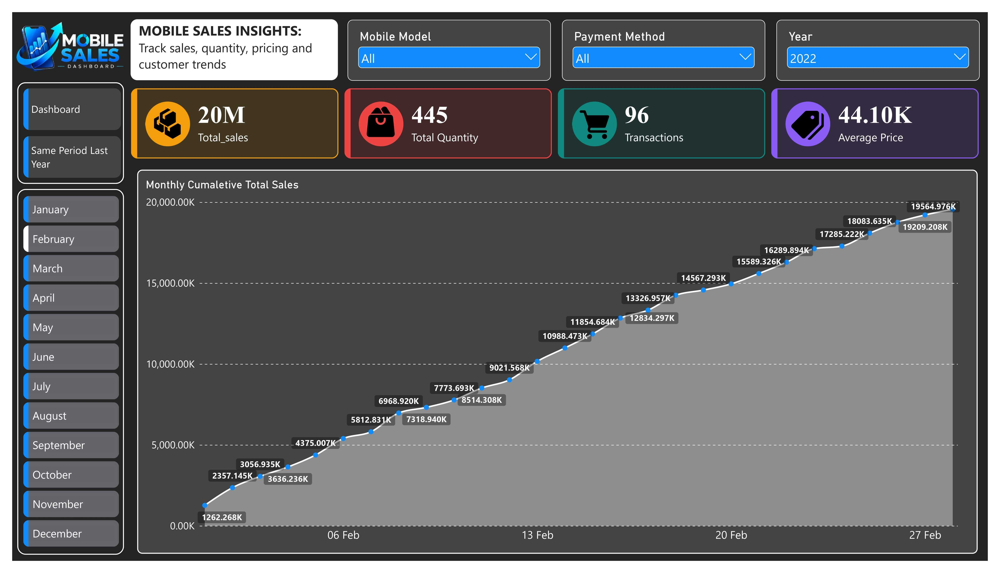
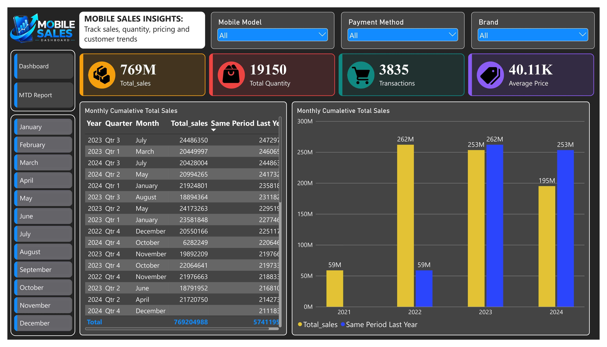

# Mobile Sales Analysis — Power BI

## Project Overview

This project is an interactive Power BI dashboard created to analyze mobile sales performance and identify trends across products, locations, payment methods, customer ratings, and time.

The dashboard was built as a hands-on Power BI project, covering data preparation, DAX calculations, report design, and interactive analysis.

## Objectives

The main objectives of the project are to:

- Track overall sales, quantity, transactions, and average price.
- Analyze sales performance across months and days.
- Compare sales across cities.
- Identify the top-selling mobile models.
- Understand customer rating distribution.
- Analyze payment method usage.
- Study monthly cumulative sales performance.
- Compare current-period sales with the same period from the previous year.

## Tools & Technologies

- **Power BI** — dashboard development and visualization
- **Power Query** — data cleaning and transformation
- **DAX** — calculated measures and time-based analysis
- **Microsoft Excel** — source dataset and data preparation

## Dataset

The project uses a mobile sales dataset containing transaction-level information such as:

- Transaction ID
- Date
- Brand
- Mobile Model
- Payment Method
- Quantity
- Price
- City
- Customer Rating
- Day / Month / Year-related fields

The detailed field-level definitions are documented in the **Data Dictionary** included in this repository.

## Data Preparation

Before building the dashboard, the dataset was prepared for analysis by:

1. Checking the source data structure and fields.
2. Cleaning and formatting the data.
3. Preparing date-related fields for time analysis.
4. Creating the required relationships/fields for report filtering.
5. Creating DAX measures used throughout the dashboard.

## Key DAX Measures

Some of the main calculations used in the report include measures for:

- Total Sales
- Total Quantity
- Transactions
- Average Price
- Monthly / cumulative sales
- Month-to-date analysis
- Same Period Last Year comparison

Detailed formulas and explanations are available in:

`Documentation/DAX_Measures.md`

## Dashboard Pages

### 1. Main Dashboard

The main dashboard provides an overall view of mobile sales performance.

It includes:

- Total Sales
- Total Quantity
- Transactions
- Average Price
- Total Sales by City
- Monthly Quantity Trend
- Top 3 Best-Selling Models
- Customer Ratings
- Payment Methods
- Day-wise Sales

The dashboard also includes interactive slicers for:

- Mobile Model
- Payment Method
- Brand / Year

and navigation buttons for moving between report pages and months.

### 2. MTD Report

The MTD report focuses on cumulative sales performance over the selected period.

The page uses a cumulative sales trend to show how sales build up throughout the month and includes interactive filtering.

### 3. Same Period Last Year

This page is designed to compare sales performance across years.

It includes:

- A detailed table showing year, quarter, month, total sales, and same-period-last-year sales.
- A year-wise comparison chart for Total Sales vs Same Period Last Year.

## Dashboard Preview

### Main Dashboard



### MTD Report



### Same Period Last Year



## Sample Overall Metrics

When the report is viewed without restrictive filters, the dashboard shows approximately:

| Metric | Value |
|---|---:|
| Total Sales | 769M |
| Total Quantity | 19,150 |
| Transactions | 3,835 |
| Average Price | 40.11K |

These values change dynamically when filters are applied.

## Project Workflow

```text
Source Dataset
      ↓
Data Cleaning & Transformation
      ↓
Data Preparation
      ↓
DAX Measures
      ↓
Data Visualization
      ↓
Interactive Dashboard
      ↓
Sales Analysis & Comparison
```

## Repository Structure

```text
mobile-sales-analysis-powerbi/
│
├── Dataset/
│   └── Mobile Sales Data.xlsx
│
├── Workbook/
│   └── Mobile-sale-analysis.pbix
│
├── Dashboard/
│   ├── 01_Main_Dashboard.png
│   ├── 02_MTD_Report.png
│   └── 03_Same_Period_Last_Year.png
│
├── Documentation/
│   └── DAX_Measures.md
│
└── README.md
```

## How to Use

1. Download or clone this repository.
2. Open the `.pbix` file using **Power BI Desktop**.
3. Use the slicers and navigation buttons to explore the dashboard.
4. Apply different filters to analyze specific brands, models, payment methods, years, and time periods.

## Key Takeaways

The dashboard provides a single place to explore mobile sales performance from multiple perspectives. It combines high-level KPIs with product, city, customer, payment, and time-based analysis.

The project helped me practice:

- Building interactive Power BI dashboards
- Writing DAX measures
- Working with Power Query
- Creating time-based calculations
- Choosing appropriate visualizations
- Designing a consistent multi-page report


## Author

**Satyam Vishwakarma**

BBA Graduate | Aspiring Data Analyst

This project is part of my data analytics portfolio and demonstrates my practical work with Power BI, DAX, Power Query, and data visualization.
